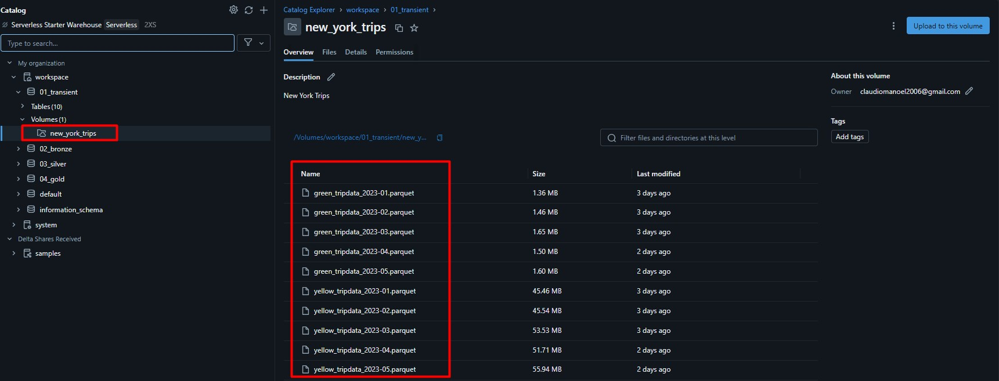
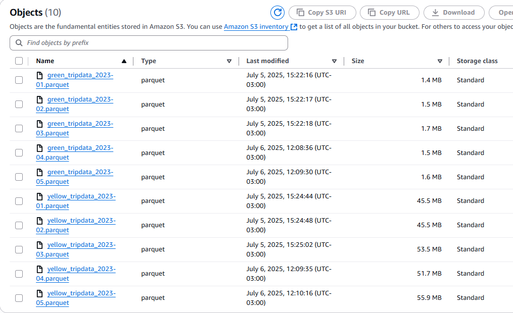
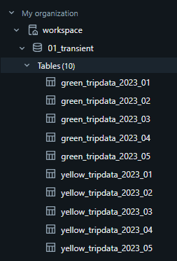
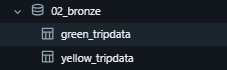
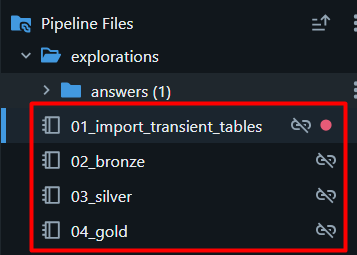
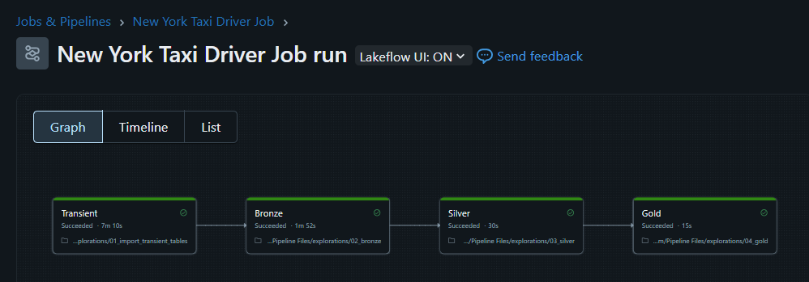
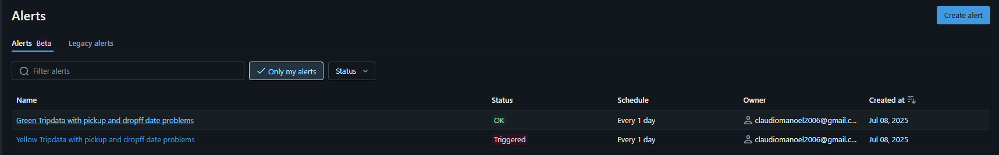
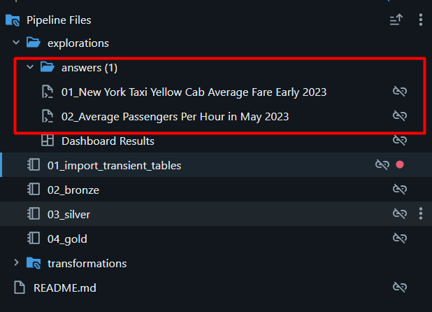
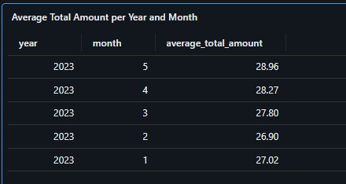
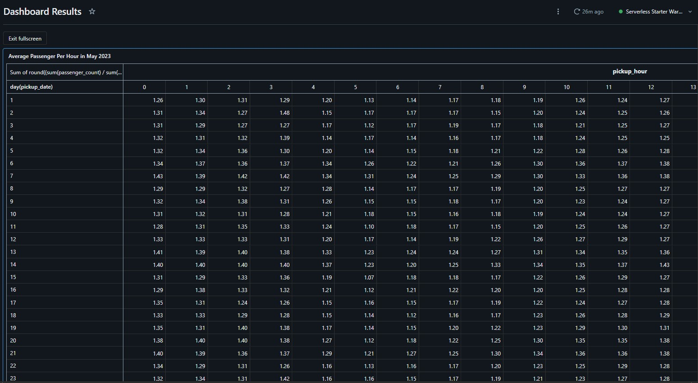

# NYC Taxi Data — End-to-End Data Engineering Case

> A full Lakehouse pipeline built on Databricks, ingesting millions of New York City taxi trip records and surfacing actionable analytics through a Medallion architecture.

---

## The Challenge

This case covers the full data engineering lifecycle:

- **Ingest** raw NYC taxi trip data (Jan–May 2023) into a Data Lake
- **Transform** and model the data across structured layers
- **Expose** clean, queryable tables for analytical consumption
- **Answer** business questions with SQL and visualizations

### Dataset

Trip records are sourced from the [NYC Taxi & Limousine Commission](https://www.nyc.gov/site/tlc/about/tlc-trip-record-data.page), covering both **Yellow** and **Green** cab fleets. The pipeline must guarantee the availability of these key fields in the consumption layer:

| Column | Description |
|---|---|
| `VendorID` | Provider that supplied the trip record |
| `passenger_count` | Number of passengers |
| `total_amount` | Total fare charged |
| `tpep_pickup_datetime` | Trip start timestamp |
| `tpep_dropoff_datetime` | Trip end timestamp |

### Business Questions

1. **What is the average monthly fare** (`total_amount`) across all Yellow Cab trips in early 2023?
2. **What is the average number of passengers per hour of the day** in May 2023, across the entire fleet?

---

## Solution

### Tech Stack

- **Platform:** Databricks Community Edition
- **Processing:** PySpark
- **Storage:** Delta Lake (backed by S3)
- **Orchestration:** Databricks Jobs
- **Query Layer:** SQL
- **Monitoring:** Databricks Alerts

### Repository Structure

```
case/
├── src/
│   └── pipeline/       # PySpark notebooks for each Medallion layer
├── analysis/
│   └── answers/      # SQL scripts with answers to the business questions
├── README.md
└── requirements.txt
```

---

## Architecture — Medallion Lakehouse

The solution follows the **Medallion architecture** (Transient → Bronze → Silver → Gold), designed for incremental refinement and full data lineage traceability.

```
Raw Files (Volume)
      │
      ▼
 01_transient   ← Landing zone: one temp table per source file
      │
      ▼
  02_bronze     ← Raw mirror tables with lineage metadata
      │
      ▼
  03_silver     ← Unified, cleaned NYC taxi table
      │
      ▼
   04_gold      ← Aggregated table optimized for analytics
```

---

### Layer 1 — Transient (Landing Zone)

Source files (Jan–May 2023) were manually downloaded and uploaded to the **`new_york_trips`** volume in the **`01_transient`** database. Each file is materialized as a temporary table, enabling controlled ingestion into the bronze layer.



Databricks persists these volumes transparently to S3:





---

### Layer 2 — Bronze (Raw + Lineage)

The bronze layer contains two tables — **`green_tripdata`** and **`yellow_tripdata`** — that mirror the source files exactly, with two additional metadata columns:

| Column | Purpose |
|---|---|
| `transient_table_name` | Traces each record back to its source file |
| `ingestion_datetime` | UTC timestamp of when the record entered the Lakehouse |

Partition columns (`lpep_pickup_date` for green, `tpep_pickup_date` for yellow) enable efficient date-based query pruning.

**Data quality filter:** Records with any negative numeric field are rejected at ingestion:

```
total_amount < 0 OR passenger_count < 0 OR trip_distance < 0
OR fare_amount < 0 OR extra < 0 OR mta_tax < 0
OR tip_amount < 0 OR tolls_amount < 0 OR improvement_surcharge < 0
```



---

### Layer 3 — Silver (Unified & Cleaned)

The silver table **`new_york_taxi`** merges both bronze tables into a single, standardized view:

| Column | Description |
|---|---|
| `vendor_id` | Cab vendor |
| `passenger_count` | Number of passengers |
| `total_amount` | Total fare |
| `pickup_date` | Date of pickup |
| `pickup_datetime` | Full pickup timestamp |
| `dropoff_datetime` | Full dropoff timestamp |
| `color` | `green` or `yellow` |
| `__timestamp` | Record processing timestamp |

---

### Layer 4 — Gold (Analytics-Ready)

The gold table **`new_york_taxi_by_hour`** pre-aggregates data by day, hour, and cab color for fast analytical queries:

| Column | Description |
|---|---|
| `pickup_date` | Date of trips |
| `pickup_hour` | Hour of day (0–23) |
| `color` | Cab color |
| `quantity` | Number of trips |
| `total_amount` | Sum of fares |
| `passenger_count` | Total passengers |

---

## Pipeline & Orchestration

Each Medallion layer has a dedicated PySpark notebook. All notebooks are wired together in the **New York Taxi Driver Job**, where each notebook runs as a sequential task:





This approach keeps development straightforward — notebooks are easy to run and debug interactively — while the Job provides reliable, repeatable orchestration.

---

## Data Quality Monitoring

Two scheduled alerts run daily to catch data integrity issues in the bronze layer:

**Green Tripdata — dropoff before pickup:**
```sql
SELECT COUNT(1) FROM workspace.`02_bronze`.green_tripdata
WHERE lpep_pickup_datetime > lpep_dropoff_datetime
```

**Yellow Tripdata — dropoff before pickup:**
```sql
SELECT COUNT(1) FROM workspace.`02_bronze`.yellow_tripdata
WHERE tpep_pickup_datetime > tpep_dropoff_datetime
```



---

## Results

SQL answer scripts are located in `analysis/answers/`:



### Q1 — Average monthly fare for Yellow Cab (Jan–May 2023)



### Q2 — Average passengers per hour of day in May 2023



---

## How to Run

1. Clone this repository
2. Install dependencies: `pip install -r requirements.txt`
3. Upload source files to a Databricks volume
4. Run the notebooks in `src/pipeline/` in order (01 → 04), or trigger the **New York Taxi Driver Job**
5. Query results using the SQL scripts in `analysis/answers/`